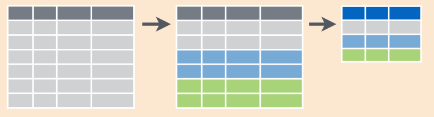

# What is dplyr?


* **dplyr** is a package for making data manipulation easier
	*  Packages in R are basically sets of additional functions that let you do more stuff
\pause
* dplyr provides **easy** **tools** for the most common **data** **manipulation** tasks
\pause
* dplyr addresses this by porting much of the computation to C++
\pause
* An additional feature is the ability to work directly with data stored in an **external** **database**


# What is dplyr?

**Before start to dig into dplyr functions we learn how to import data into R**

* To download the data, run the following:

\small
```{r eval=FALSE}
download.file("https://ndownloader.figshare.com/files/2292169",
			  "portal_data_joined.csv")
```

* You are now ready to load the data:

\small
```{r eval=FALSE}
surveys <- read.csv('portal_data_joined.csv')
```

\pause

* Converts data to tbl class. tbl’s are easier to examine than
  data frames. R displays only the data that fits onscreen

\small
```{r eval=FALSE}
surveys <- tbl_df(surveys)
```

# What is dplyr?

We're going to learn some of the *most common dplyr functions:*

* **select**

* **filter**

* **arrange**

* **mutate**

* **group\_by**

* **summarize**


# Select

{ width=40% }

* To select columns of a data frame, use select()
	*  The **first** **argument** to this function is the **data** **frame**
	*  The **subsequent** **arguments** are the **columns** **to** **keep**


\small
```{r eval=FALSE}
select(surveys, plot_id, species_id, weight)
```

# Select

* select is much more powerful than just select the interest columns
	*  You can remove one column

\small
```{r eval=FALSE}
select(surveys, -weight)
```

\pause

	*  Select columns whose name contains a character string

\small
```{r eval=FALSE}
select(surveys, contains("ec"))
```


# Select


* Select columns whose name starts with a character string

\small
```{r eval=FALSE}
select(surveys, starts_with("s"))
```

\pause

* Select all columns between Sepal.Length and Petal.Width (inclusive).

\small
```{r eval=FALSE}
select(surveys, plot_id:weight)
```

\pause

* Select every column
\small
```{r eval=FALSE}
select(surveys, weight, everything())
```

# Filter

{ width=40% }


* To select rows of a data frame, use filter()
	*  The **first** **argument** to this function is the **data** **frame**
	*  The **subsequent** **arguments** are the **conditions for the subsetting**

\small
```{r eval=FALSE}
filter(surveys, year == 1995)
```

# Filter

* Extract rows that meet logical criteria

\small
```{r eval=FALSE}
filter(surveys, year > 1995)
filter(surveys, year > 1995, day == 12)
filter(surveys, year > 1995, day == 12 | day == 24)
filter(surveys, year > 1995, day == 12 | (day == 24 & sex != "F"))
```

**CHALLENGE**

Subset the surveys dataset:

* The data from spring of 1999

* All the females heavier than 100 after 1995

* All the female heavier than 150 in days 11 and 18 and the males of NL specie

\pause
\small
```{r eval=FALSE}
filter(surveys, year == 1999, month >= 3 & month <= 6 )
filter(surveys, sex == "F", weight > 100, year > 1995)
filter(surveys, (sex == "F" & (day == 11 | day == 18)) |
	   (sex == "M" & species_id == "NL"))
```

# Pipes

But what if you wanted to **select** **and** **filter** **at** **the** **same** **time**? 

There are *three ways* to do this: 

\pause 

* use intermediate steps
	*  \scriptsize you essentially create a temporary data frame and use that as input to the next function
\small
```{r eval=FALSE}
tmp <- select(surveys, plot_id, species_id, weight)
filter(tmp, weight > 270)
```

\pause 

* nested functions
	*  \scriptsize one function inside of another

\small
```{r eval=FALSE}
filter(select(surveys, plot_id, species_id, weight), weight > 270)
```

# Pipes

* pipes
	*  \scriptsize pipes let you take the output of one function and send it directly to the next

\small
```{r eval=FALSE}
select(surveys, plot_id, species_id, weight) %>%
	filter(weight > 270)
```
\pause 

* Pipes in R look like %>% and are made available via the magrittr package, installed automatically with dplyr
\pause
* **%>% takes the object on its left and passes it as the first argument to the function on its right**, we don’t need to explicitly include it as an argument to the filter() and select() functions anymore

\small
```{r eval=FALSE}
surveys %>%
	  filter(weight < 5) %>%
	  select(species_id, sex, weight)
```

# Pipes

**CHALLANGE**

* Filter females from specie NL and select year and weight
* Filter male from 1995 and report all columns apart for month
* Filter 1995, rodent and report column: taxa, year and then all the others 
\pause
\small
```{r eval=FALSE}
surveys %>%
	filter(sex == "F", species_id == "NL") %>%
	select(year, weight)

surveys %>%
	filter(sex == "M", year == 1995) %>%
	select(-month)

surveys %>%
	filter(year == 1995, taxa == "Rodent") %>%
	select(taxa, year, everything())
```

# Mutate

Frequently you’ll want to **create new columns based on the values in existing columns**

For this we’ll use **mutate()**

\small
```{r eval=FALSE}
surveys %>%
	  mutate(weight_kg = weight / 1000) %>%
	  select(weight, weight_kg)
```
\pause
The first few rows of the output are full of NAs, so if we wanted to remove those

\small
```{r eval=FALSE}
surveys %>%
	  filter(!is.na(weight)) %>%
	  mutate(weight_kg = weight / 1000) %>%
	  select(weight, weight_kg)
```

# Mutate

**CHALLENGE**

Create a new data frame from the survey data that meets the following criteria:

* contains only the species_id column and a new column called hindfoot_half containing values that are half the hindfoot_length values.

* In the hindfoot_half column, there are no NAs and all values are less than 30.

\pause

\small
```{r eval=FALSE}
surveys %>%
	filter(!is.na(hindfoot_length)) %>%
	mutate(hindfoot_half = hindfoot_length / 2) %>%
	select(species_id, hindfoot_half)
```

# Group_by and Summarize

Many data analysis tasks can be approached using the **split**-**apply**-**combine** **paradigm**:

* **split** the data into groups

* **apply** some analysis to each group

* **combine** the results

{ width=60% }

# Group_by and Summarize

\small
```{r eval=FALSE}
surveys %>%
	  group_by(sex) %>%
	  summarize(mean_weight = mean(weight, na.rm = TRUE))
```

**CHALLANGE**

Remove the first row of the output that contains not male or female


# Group_by and Summarize

* You can also group by multiple columns:

\small
```{r eval=FALSE}
surveys %>%
	  filter(!is.na(weight)) %>%
	  group_by(sex, species_id) %>%
	  summarize(mean_weight = mean(weight))
```

\pause
\normalsize
* If you want to display more data:

\small
```{r eval=FALSE}
surveys %>%
	  filter(!is.na(weight)) %>%
	  group_by(sex, species_id) %>%
	  summarize(mean_weight = mean(weight)) %>%
	  print(n = 15)
```

# Group_by and Summarize

* Once the data are grouped, you can also summarize multiple variables at the same time

\small
```{r eval=FALSE}
surveys %>%
	  filter(!is.na(weight)) %>%
	  group_by(sex, species_id) %>%
	  summarize(mean_weight = mean(weight),
				  min_weight = min(weight)) %>%
	  print(n = 15)
```

\pause
* How to know the number of observations found for each factor or combination of factors

\small
```{r eval=FALSE}
surveys %>%
	  group_by(sex) %>%
	    tally
```

\tiny tally() is the action applied to the groups created by group_by() and counts the total number of records for each category


# Arrange ==TODO==


# Challenge 1 ==TODO==

How many individuals were caught in each plot_type surveyed?
Use group_by() and summarize() to find the mean, min, and max hindfoot length for each species (using species_id).
What was the heaviest animal measured in each year? Return the columns year,  genus, species_id, and weight.
You saw above how to count the number of individuals of each sex using a combination of group_by() and tally(). How could you get the same result using group_by() and summarize()? Hint: see ?n.

# Challange 2 ==TODO==

the same of yesterday


