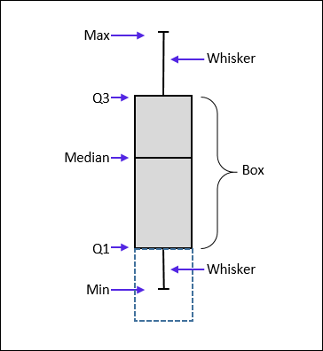

# Importance of data visualization

\begin{center}

\textsc{SUMMARY STATISTICS VS DATA VISUALIZATION}

\textbf{Ascomb's quartet}

\tiny Use the file example "scraping.R" in Resource directory

\end{center}


# Plotting systems

* **Base** **package**
    *  Static canvas
	*  They can not be modified once they are plotted

* **Grid** **package**
    *  Provide low-level graphic functions to construct complex plots
    *  Two fundamentals components:
	    *  Create graphic outputs
		*  Layer and position outputs with veiwports


# What is ggplot2

* ggplot2 is a plotting system for R, based on the **grammar** **of** **graphics**
    *  It  is a tool that enables us to concisely describe the components
	  of a graphic \tiny [http://vita.had.co.nz/papers/layered-grammar.pdf]
* ggplot2 makes **simple** **to** **create** **complex** **plots** from data in a dataframe

* help creating **publication** **quality** **plots** with a **minimal** **amount** **of** **settings** and tweaking

* ggplot graphics are built step by step by **adding** **new** **elements**


# Plotting with ggplot2

To build a ggplot we need to:

* **bind** **the** **plot** to a specific data frame using the data argument

\small
```{r eval=FALSE}
library(tidyverse)
surveys_complete <- read.csv("surveys_complete.csv")
ggplot(data = surveys_complete)
```

\pause

* \normalsize define **aesthetics** (aes), by selecting the variables to be plotted

\small
```{r eval=FALSE}
ggplot(data = surveys_complete,
	   aes(x = weight, y = hindfoot_length))
```


# Plotting with ggplot2

* add **geoms** – graphical representation of the data in the plot 

\small
```{r eval=FALSE}
ggplot(data = surveys_complete,
	aes(x = weight, y = hindfoot_length)) +
  geom_point()
```

\pause 

* \normalsize The **+** in the ggplot2 package is particularly useful because it allows you to modify existing ggplot objects


# Plotting with ggplot2

* Set up plot “templates” and conveniently explore different types of plots

\small
```{r eval=FALSE}
# Create
surveys_plot <- ggplot(data = surveys_complete,
					   aes(x = weight, y = hindfoot_length))

# Draw the plot
surveys_plot + geom_point()
surveys_plot + geom_line()
surveys_plot + geom_count()
surveys_plot + geom_point() + geom_rug()
```

# Building your plots iteratively

Building plots with ggplot is typically an **iterative** **process**

We start by:

* defining the dataset
\pause
* lay the axes
\pause
* choose a geom

\small
```{r eval=FALSE}
surveys_plot <- ggplot(data = surveys_complete,
					  aes(x = weight, y = hindfoot_length)) 
surveys_plot + geom_point()
```
\normalsize


# Building your plots iteratively

We start **modifying** **this** **plot** to extract more information from it:

* Add transparency to avoid overplotting

\small
```{r eval=FALSE}
surveys_plot + geom_point(alpha = 0.1)
```
\normalsize
\pause

* We can also add colors for all the points

\small
```{r eval=FALSE}
surveys_plot + geom_point(alpha = 0.1, color = "blue")
```
\normalsize
\pause

* Color each species in the plot differently

\small
```{r eval=FALSE}
surveys_plot + geom_point(alpha = 0.1, aes(color = species_id))
```
\normalsize


# Challange

* Plot a scatter plot with different colors for male and female

* Plot a scatter plot with different shapes for male and female

* Plot a scatter plot with different color and shapes for male and female

* Plot a scatter plot with point size 10

\pause

\small
```{r eval=FALSE}
surveys_plot + geom_point(aes(color = sex))

surveys_plot + geom_point(aes(shape = sex))

surveys_plot + geom_point(aes(color = sex, shape = sex))

surveys_plot + geom_point(aes(color = sex, shape = sex),
						  size = 10)

```
\normalsize


# Boxplot




# Boxplot

**Visualising** **the** **distribution** of hindfoot_length **within** **each** **species**

\small
```{r eval=FALSE}
surveys_plot <- ggplot(data = surveys_complete,
					  aes(x = species_id, y = hindfoot_length))
surveys_plot + geom_boxplot()
```
\normalsize

# Boxplot

* By **adding** **points** to boxplot, we can have a better idea of the number of measurements and of their distribution

\small
```{r eval=FALSE}
surveys_plot + geom_boxplot(alpha = 0) +
			   geom_jitter(alpha = 0.3, color = "tomato")
```
\normalsize

\pause

* **Boxplots** **are** **useful** **summaries**, BUT **hide** **the** **shape** of the distribution.

* Notice how the boxplot layer is behind the jitter layer?

* What do you need to change in the code to put the boxplot in front of the points such that it’s not hidden?


# Challenge

* Try to plot before the point and then the boxplot

\pause

\small
```{r eval=FALSE}
surveys_plot + geom_jitter(alpha = 0.3, color = "tomato") +
			   geom_boxplot(alpha = 0)
```
\normalsize

\pause

* An alternative to the boxplot is the violin plot, where the shape is drawn.
	*  Replace the box plot we produced with a violin plot

\pause

\small
```{r eval=FALSE}
surveys_plot + geom_violin(alpha = 0)
```
\normalsize


# Challenge

* In many types of data, it is important to consider the scale of the observations
    *  Create boxplot for species_id and weight and represent weight on the log10 scale; see  scale_y_log10()

\pause

\small
```{r eval=FALSE}
ggplot(data = surveys_complete, aes(x = species_id, y = weight)) +
	   geom_boxplot(alpha = 0)
ggplot(data = surveys_complete, aes(x = species_id, y = weight)) +
	   geom_boxplot(alpha = 0) + scale_y_log10()
```
\normalsize

\pause

* Then add color to the datapoints on your boxplot according to the plot from which the sample was taken (plot_id)

\pause

\small
```{r eval=FALSE}
ggplot(data = surveys_complete, aes(x = species_id, y = weight)) +
	   geom_jitter(aes(color = as.factor(plot_id))) +
	   geom_boxplot(alpha = 0) + 
	   scale_y_log10()
```
\normalsize

# Plotting time series data

* Let’s calculate **number** **of** **counts** **per** **year** for each species
    *  To do that we need to **group** **data** first and count records within each group

\pause

\small
```{r eval=FALSE}
yearly_counts <- surveys_complete %>%
                 group_by(year, species_id) %>%
                 tally
```
\normalsize

\pause 

  * Timelapse data can be visualised as a line plot with years on x-axis and counts on y-axis

\small
```{r eval=FALSE}
timeseries_plot <- ggplot(data = yearly_counts, aes(x = year,
													y = n)) 
timeseries_plot + geom_line()
```
\normalsize


# Plotting time series data

* Unfortunately this does not work, because we plot data for **all** **the** **species** **together**
    *  We need to group the data by species_id

\small
```{r eval=FALSE}
timeseries_plot <- ggplot(data = yearly_counts,
						  aes(x = year, y = n, group = species_id)) 
timeseries_plot + geom_line()
```
\normalsize

# Plotting time series data

* We will be able to distinguish species in the plot if we will **add** **colors**

\small
```{r eval=FALSE}
timeseries_plot <- ggplot(data = yearly_counts,
						  aes(x = year, y = n,
							  group = species_id,
							  colour = species_id)) 
timeseries_plot + geom_line()
```
\normalsize


# Challenge

* Create a new data set called month_counts [group by month and species_id]

* Plot time series

* Add points


\pause 

\small
```{r eval=FALSE}
month_counts <- surveys_complete %>%
                 group_by(month, species_id) %>%
                 tally
timeseries_plot <- ggplot(data = month_counts,
						  aes(x = as.factor(month), y = n,
							  group = species_id,
							  colour = species_id)) 
timeseries_plot + geom_line()
timeseries_plot + geom_line() + geom_point()
```
\normalsize


# Faceting

* ggplot has a special technique called faceting that allows to **split** **one** **plot** **into** **multiple** **plots** based on a factor included in the dataset

\small
```{r eval=FALSE}
timeseries_plot <- ggplot(data = yearly_counts,
						  aes(x = year, y = n, group = species_id,
							  colour = species_id)) 
timeseries_plot + geom_line() + facet_wrap(~ species_id)
```
\normalsize

# Challenge

* Now we would like to also **split** **line** **in** **each** **plot** **by** **sex** of each individual measured

\pause

\small
```{r eval=FALSE}
yearly_sex_counts <- surveys_complete %>%
                      group_by(year, species_id, sex) %>%
                      tally
```

\pause

\small
```{r eval=FALSE}
timeseries_plot <- ggplot(data = yearly_sex_counts,
						  aes(x = year, y = n, color = sex,
							  group = sex)) 

timeseries_plot + geom_line() + facet_wrap(~ species_id)
```
\normalsize

\pause

* Add a double split

\small
```{r eval=FALSE}
timeseries_plot + geom_line() + facet_wrap(species_id ~ sex)
```
\normalsize


# Customization

* Take a look at the [ggplot2 cheat sheet](https://www.rstudio.com/wp-content/uploads/2015/08/ggplot2-cheatsheet.pdf), and think of ways to improve the plot

* Usually plots with white background look more readable when printed. We can set the background to white using the function  theme_bw()

\small
```{r eval=FALSE}
timeseries_plot + geom_line() +
	theme_bw() +
	facet_wrap(~ species_id)
```
\normalsize

\pause

* Remove completely the grid

\small
```{r eval=FALSE}
timeseries_plot + geom_line() +
	theme_bw() +
	theme(panel.grid.major.x = element_blank(),
       panel.grid.minor.x = element_blank(),
       panel.grid.major.y = element_blank(),
       panel.grid.minor.y = element_blank()) +
	facet_wrap(~ species_id)
```
\normalsize


# Customization

* Let’s change names of axes to something more informative

\small
```{r eval=FALSE}
timeseries_plot + geom_line() + facet_wrap(~ species_id) +
    labs(title = 'Observed species in time',
         x = 'Year of observation',
         y = 'Number of species') +
    theme_bw()
```
\normalsize

\pause

* The axes have more informative names, but their readability can be improved

\small
```{r eval=FALSE}
timeseries_plot + geom_line() + facet_wrap(~ species_id) +
    labs(title = 'Observed species in time',
        x = 'Year of observation',
        y = 'Number of species') +
    theme_bw() +
    theme(text=element_text(size=16, family="Arial"))
```
\normalsize


# Customization

* Let’s **change** **the** **orientation** **of** **the** **labels** and adjust them vertically and horizontally so they don’t overlap

\small
```{r eval=FALSE}
timeseries_plot + geom_line() + facet_wrap(~ species_id) +
    labs(title = 'Observed species in time',
        x = 'Year of observation',
        y = 'Number of species') +
    theme_bw() +
    theme(axis.text.x = element_text(colour="grey20", size=12,
									 angle=90, hjust=.5, vjust=.5),
          axis.text.y = element_text(colour="grey20", size=12),
          text=element_text(size=16, family="Arial"))
```
\normalsize


# Customization

* If you like the changes you created, you can save them as an object to easily apply them

\small
```{r eval=FALSE}
arial_grey_theme <-
		theme(axis.text.x = element_text(colour="grey20",
							size=12, angle=90, hjust=.5, vjust=.5),
              axis.text.y = element_text(colour="grey20", size=12),
              text=element_text(size=16, family="Arial"))
              
ggplot(surveys_complete, aes(x = species_id, y = hindfoot_length)) +
    geom_boxplot() +
    arial_grey_theme
```
\normalsize


# Challenge

* With all of this information in hand, please **try** **to** **improve** **one** **of** **the** **plots** **we** **generated**, creating a beautiful graph of your own


# Save plot

* After creating your plot, you can save it to a file in your favourite format

\small
```{r eval=FALSE}
my_plot <- ggplot(data = yearly_sex_counts, aes(x = year, y = n,
									  color = sex, group = sex)) +
    geom_line() +
    facet_wrap(~ species_id) +
    labs(title = 'Observed species in time',
        x = 'Year of observation',
        y = 'Number of species') +
    theme_bw() +
    theme(axis.text.x = element_text(colour="grey20", size=12,
									 angle=90, hjust=.5, vjust=.5),
          axis.text.y = element_text(colour="grey20", size=12),
          text=element_text(size=16, family="Arial"))

ggsave("name_of_file.png", my_plot, width=15, height=10)
```
\normalsize


# Challenge

* **Download** **the** **data** from [https://ndownloader.figshare.com/files/1797870]

* Play with the data an **plot** **them** **as** **beautiful** **as** **you** **like**

